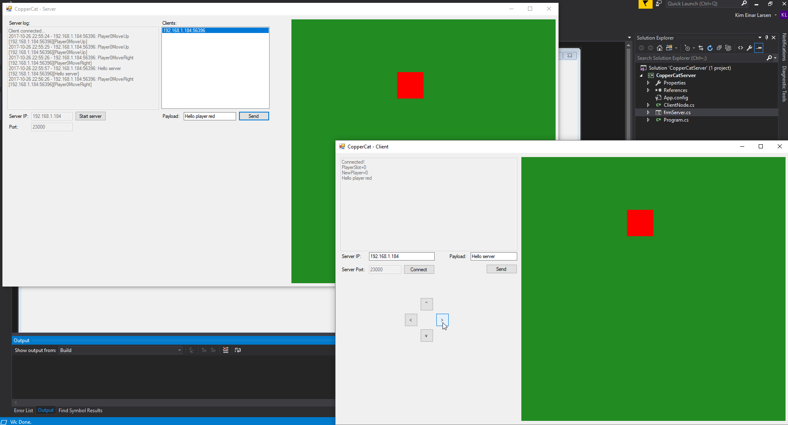

# CopperCat

The purpose of this project was to create a server and a client, using the TCP network protocol. I wanted the client able to connect to the server, retrieve player-world data from the server, to update the player position to the server. Also able to send and retrieve custom payloads. The server can to handle up to 4 players. Each player can move their character (red box) in the north, west, south and east directions. Also, when a player has left the server, the server must handle the disconnection and reset the player slot.

Tags: C#, TCP Server & Client, Project
